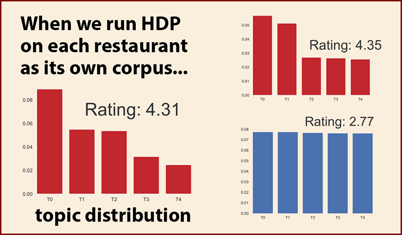
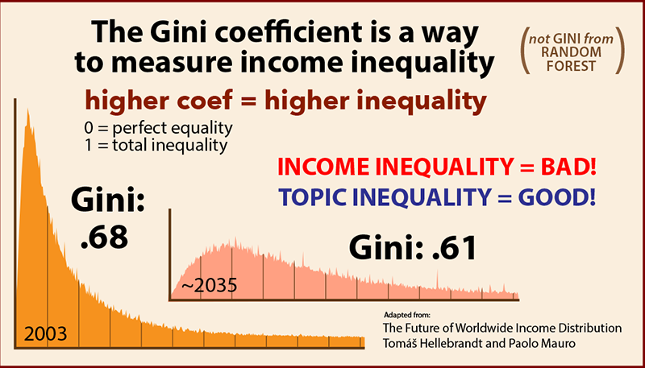
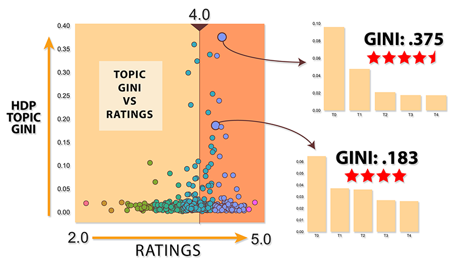
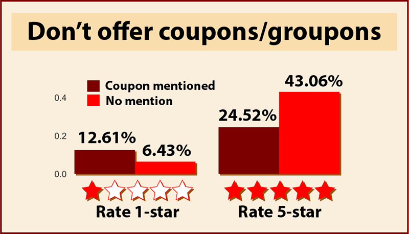
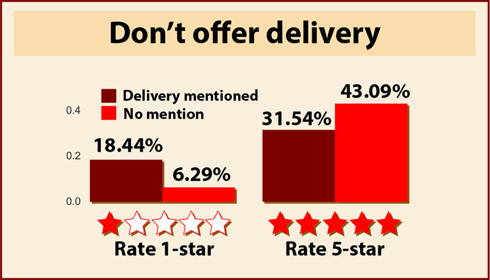
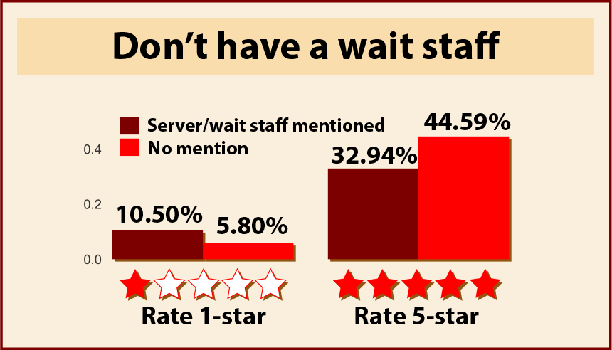

# Introduction
I have a bad habit of jumping to the 1-star reviews on Yelp, ignoring all the glowing 5-star reviews. At first blush, most 1-star reviews seem to be the unique missives of extremely grumpy, easily offended persons who take to Yelp retributively. However, having read more than enough sour reviews over the years, I've realized this uniqueness characterizes 1-star reviews more than any other rating, regardless of the nature and history of the reviewer. I am often reminded of a famous quote from Leo Tolstoy:

>"All happy families are alike; each unhappy family is unhappy in its own way" - Leo Tolstoy, _Anna Karenina_

# From observation to objective
With these observations in mind and Leo Tolstoy's guidance on happiness, can we predict a restaurant's Yelp rating from the number of topics in its reviews? Will happy restaurants have a more focused distribution of topics? And, conversely, will the unhappy restaurants be more diverse in their complaints and topics?

# The data
Our data comes from once place - Denver, Colorado. Yelp, by policy, returns up to 1000 businesses per query and that's it. This should be enough if we supplement it with some shuttered restaurants for balance. In early June, 2017, our query of <a href="https://www.yelp.com/search?cflt=restaurants&find_loc=Denver%2C+CO">restaurants in Denver</a> returned 992 active restaurants. After removing those with less than 10 reviews, our total number from Yelp stood at 921. With 71 restaurants having less than 10 reviews, this seems like a pretty good clue we are nearing the end the list for Denver.

For balance, I supplemented this list of 921 with 264 shuttered restaurants, giving us a total of 1191 Denver restaurants. Survival bias is surely at play, and adding some shuttered restaurants to the mix might balance things out. From these 1191 restaurants, I grabbed all 228,276 their reviews. Not quite n=all for Denver restaurants on Yelp, but I think we are getting close. Surprisingly, at least for me, the overall average for all the reviews is 3.94 stars, well above the middling value of 3 one might naively suppose. Of note, Yelp rounds to the nearest half-star in their listing summary for a restaurant, but I've calculated the true star average for each restaurant based on all its reviews.

# EDA and problem ideation
As part of the initial EDA I cleaned and stemmed the reviews, then ran <a href="https://radimrehurek.com/gensim/models/ldamodel.html">Gensim's LDA model</a> on the entire corpus. LDA stands for Latent Dirichlet Allocation. This is a soft topic model that allows for each document in the corpus to belong to multiple topics. It is a bag-of-words model that takes no account of word order.

At this point, I wasn't sure where the project was heading and my early observation about 1-star reviews had not resurfaced to my consciousness. Looking over the basic topic-modeling results, one thing I noticed was how often family members are mentioned in reviews, and how highly ranked such terms are in the corpus of Denver Yelp reviews. Even a casual browsing of Yelp will reveal many reviewers speak for the entire dinner party, diligently documenting what the other members of their party ate and their opinions of the grub.

These common family reviews raised a question, what else is common among all the reviews, regardless of the food served? I wondered if I could create an enormous collection of food and family-related terms to get down to the most basic abstract quality of being a good review.

After a few attempts with LDA and TF-IDF to get at the heart of abstract goodness, I realized the task was impossible, at least for me. Topic models and similarity measures are always going to find a difference between sushi and steak restaurants at every pass. Yet, as a competent, language-processing primate, there was still some sense of sameness in those reviews that I wanted to capture in topic modeling. It dawned on me I could use they same analysis on each restaurant separately as its own corpus. I would lose similarity measures across all the reviews, but I could compare intra-restaurant topic distributions. This seemed novel in itself - and worth a try. Of course, we have a corpus problem for smaller restaurants, dropping out those with less than 150 or so reviews

Finally, I arrived at our present question: Do well-rated restaurants have more concentrated, cohesive reviews? Or more specifically, are there fewer topics in a happy restaurant's reviews. And more topics in unhappy ones?

# Measuring happiness by topic density

Traditional topic modeling has a parameter problem -- at least for our quest. The hyperparameter of the number of topics is set before any modeling is done. This holds for Latent Dirichlet Allocation or K-means (the K is chosen before hand), whether it is for 10, 20 or 100 topics. There are ways of estimating K after the fact. But this is not our question. We want to know if happy restaurants have few topics -- because happy people are writing about the same happy topics, and whether the grumpy people in poorly rated restaurants are grousing about individual, unique complaints.  
## Estimating K, the number of topics

 If there's ever a parameter you need estimated from the data itself, like K, the number of topics, you turn to the craziest people in data science, the Bayesians. It seems they can turn any model into a _NON_-parametric one if they just throw some more math and data on it. I was not mistaken. The "Mad Dogs of Bayes" in November of 2005 came up with the <a href="https://people.eecs.berkeley.edu/~jordan/papers/hdp.pdf">Hierarchical Dirichlet Processes</a> (HDP), which among other things, allows one to estimate the number of topics in a corpus (or at least get a distribution we can truncate). I first considered using TF-IDF similarity measures within the reviews of for each restaurant. I had not given up on this approach when I stumbled upon the <a href="https://radimrehurek.com/gensim/models/hdpmodel.html">HDP model</a> in the Gensim documentation. It seemed a lucky find. (It should be noted I made up the "Mad Dogs of Bayes" nickname, to my knowledge they have no such moniker)

# The processing
 With HDP, a variant of LDA, we are still using a bag-of-words model, treating each word as a draw in a MCMC approach. We are taking no account for the order. We won't be parsing parts-of-speech, using n-grams or sentiment analysis. I used the NLTK package to clean and lemmatize the reviews, removing some basic stop words. I had previously used a port-stemmer on the reviews in the LDA during EDA, but I wasn't happy with the ugly visualizations you get with stems. I wanted visually pleasing (and readable) lemmatizing for fancy interactive charts and such.
 
It's also standard to remove infrequent words not mentioned more than n-times in a corpus (usually n is 5-10 times). For our question, I decided not to remove any words due to infrequency (other than stops). My thoughts were to see how well HDP could differentiate the good/bad reviews with no extra help. Removing low frequency words might be too much an aid to poor reviews and their individualized misery.

# The batch processing
I ran the first batch of cleaning, lemmatizing and modeling overnight on the reviews on my trusty 2015 MacBook Air expecting to find the process finished like my initial LDA model when I ran it on the entire body of reviews. I woke to find 8 restaurants had been processed, a few thousand reviews in total. With such slow progress I experimented with pooling on the NLTK lemmatizer, it did seem to be a few seconds faster. But this was going to take a month on the MacBook Air.

 
AWS to the rescue. Time was already running short, I quickly benchmarked several variants of AWS machines, the t2.large's did as well on my test as bigger instances that cost twice as much. But choosing the t2.larges was a rookie mistake. I didn't know it at the time, but the t2s are "Burstable Performance" instances whose allotted computational power rapidly gets spent in the first 5-10 minutes of processing tasks for NLP and hobble along thereafter. My benchmark of 100 reviews per 300 seconds standard turned into 900 seconds on the t2s under full load! My overnight run on 8 aws instances was a bust as well.

I went back to the old benchmarks and found that the m4.2xlarge preformed best for the buck, now excluding the t2s. Time was running really short on the project's deadline now. Far too short to even devise a queue system and brush up my Spark or Mr. Job. I did the only mathematical thing I could think of: I divided the tasks across the instances by taking the restaurant name mod 20, letting each instance numbered 0-19 take the restaurants whose name matched mod 20 its assigned number. Late at night, well past bedtime, the instances ran under my watchful eye. The pandas' dataframes and Gensim models were pickled restaurant by restaurant and sync'd via S3 command line tools on each instance. I could have gone to sleep, but I had no script to shut down each instance when it was done. The fear of over-sleeping for 12 hours and waking to a huge bill keep me awake.  In total it took about 6 hours, 100+ ecu hours, less than $200

# Are happy pickles all alike?
I had dataframes and gensim models <a href="https://radimrehurek.com/gensim/utils.html">pickled</a> by restaurant id sitting in a 8GB folder on my laptop (and on S3). This thread on <a href="https://stackoverflow.com/a/44393919">getting distributions out the HDP</a> model on Stack Overflow was vital to my project. At this point, I didn't know if I had anything promising at all bottled up in the models. Perhaps all the distributions were flat, or all were equally unequal, and Tolstoy's wisdom only applied to families and not restaurants.

# Visualizing the distributions
To my relief the topic distributions did seem to show differentiation, at least comparing the best rated restaurants to the worst. This far into the project and this short on time, this was our gamble. If you're the skeptical type, yes, these are cherry-picked examples. Don't worry, we will chart them all in just a few paragraphs more.

# How to measure the distributions
Again, time was short and the first ideas that popped into my over-strained, sleep-deprived brain was using an <a href="https://en.wikipedia.org/wiki/Income_inequality_metrics">income distribution measure</a> from economics, or the <a href="http://dni-institute.in/blogs/cart-decision-tree-gini-index-explained/">gini purity index</a> from random forests using a height distribution as the purity metric. The research was confusing, both measures pointed to the gini coefficient. It turns out they are similarly named, but quite different. I settled on economics. The gini coefficient from economics ranges from 0 to 1 with 0 being total equality, and 1 standing in for a world ruled entirely by <a href="http://time.com/money/4816165/jeff-bezos-mark-zuckerberg-bill-gates-net-worth-tech-stock-price/">Jeff Bezos, Mark Zuckerberg and Bill Gates</a>.

I borrowed two income distribution graphs from Tomas Hellebrandt and Paolo Mauro's <a href="https://piie.com/publications/working-papers/future-worldwide-income-distribution">The Future of Worldwide Income Distribution</a> to make the visual explantation more obvious for <a href="https://datascience.stackexchange.com/questions/1095/gini-coefficient-vs-gini-impurity-decision-trees">Data Science Nerds</a> unfamiliar with econometrics.

# Let's plot this thing
We have our reviews modeled, our topics distributed and our metric defined. Let's see the results. If you actually read this far, thanks.

I've plotted the topic gini on the y-axis and vs the ratings of the restaurant on the x-axis. The vertical line down the center is the average 4 (3.94 ) stars. You can see in general, the higher the gini coefficient the more likely the restaurant is to be highly rated. There are some misses. And there is a whole lot of nothing going on at the bottom with the very low gini coefficients. For a novel approach to happiness, it seems Tolstoy may have been on to something.

# What can we recommend to restaurant owners?
Using some of our original topic analysis, can we come up with some tips to keep happy customers all singing the same happy song for restaurants.

You can see that reviewers that mention coupons/groupons and other promotional topics are almost twice as likely to leave you a 1-star review. And almost half as likely to leave you a 5-star review. Don't offer coupons.

You can see that delivery is even worse. Here reviewers that mention delivery are almost 3 times as likely to leave you a 1-star review. And not nearly as likely to leave you a 5-star review. Don't offer delivery.

You can see that reviewers that mention the wait staff are, again, almost twice as likely to leave you a 1-star review. And, likewise, not nearly as likely to leave you a 5-star review. Don't have a wait staff.

# What have we done?

We've discovered fast casual. Don't have a wait staff, don't offer delivery, just focus on food and make people wait in line.

# References and credits
1) This NLP portion of this project would not have happened without the <a href="https://radimrehurek.com/gensim/">Gensim website</a>, <a href="https://groups.google.com/forum/#!forum/gensim">Gensim Google group</a> and stackoverflow's <a href="https://stackoverflow.com/questions/tagged/gensim">Gensim users</a>. The NLTK package was indispensable.

2) The instructors at Galvanize DSI <a href="https://www.linkedin.com/in/adam-richards-89146783/">Dr. Adam Richards</a> and <a href="https://www.linkedin.com/in/frankburkholder/">Dr. Frank Burkholder</a> provided mentorship and support. Not to mention two great DSRs, <a href="https://www.linkedin.com/in/steve-iannaccone/">Steve Iannaccone</a> and <a href="https://www.linkedin.com/in/brent-lemieux/">Brent Lemieux</a>

3a) Hierarchical Dirichlet Processes (HDP)
- The original HDP paper by  Yee Whye Teh, Michael I Jordan, Matthew J Beal: <a href="https://people.eecs.berkeley.edu/~jordan/papers/hdp.pdf">Hierarchical Dirichlet Processes</a>
- <a href="http://qwone.com/~jason/trg/papers/blei-chinese-04.pdf">Hierarchical Topic Models and the Nested Chinese Restaurant Process</a> by David M. Blei, Thomas L. Griffiths,  Michael I. Jordan and Joshua B. Tenenbaum
- <a href="http://mlg.eng.cam.ac.uk/tutorials/07/ywt.pdf">A Tutorial on Dirichlet Processes and Hierarchical Dirichlet Processes</a> by Yee Whye Teh
- <a href="https://stackoverflow.com/questions/31543542/hierarchical-dirichlet-process-gensim-topic-number-independent-of-corpus-size">Hierarchical Dirichlet Process Gensim topic number independent of corpus size</a> on Stack Overflow

3b) Other topic modeling resources that have been of help:
- <a href="http://sujitpal.blogspot.com/2014/08/topic-modeling-with-gensim-over-past.html">Topic Modeling with gensim</a> by Sujit Pal
- <a href="https://lists.cs.princeton.edu/pipermail/topic-models/2013-November/002595.html">Joan-Josep Vallbé's workflow</a>
- <a href="http://brandonrose.org/clustering">Document Clustering with Python
</a> by Brandon Rose
- <a href="http://www.slidedeck.io/vinay631/GADS_prj">Automated Topic Detection and Social Recommendation using LDA</a> by Vinay Manda
- <a href="https://www.quora.com/What-would-be-considered-the-least-number-of-documents-for-training-an-LDA-SLDA-topic-model-Is-a-corpus-of-200-documents-large-enough">Quora: What would be considered the least number of documents for training an LDA/SLDA topic model?</a>
- <a href="https://nbviewer.jupyter.org/github/dsquareindia/gensim/blob/280375fe14adea67ce6384ba7eabf362b05e6029/docs/notebooks/topic_coherence_tutorial.ipynb#topic=0&lambda=0.36&term=">Demonstration of the topic coherence pipeline in Gensim
</a>
- <a href="http://graus.co/thesis/string-similarity-with-tfidf-and-python/">Computing string similarity with TF-IDF and Python</a> by David Graus

4) The Gini coefficient
- <a href="https://github.com/oliviaguest/gini">Olivia Guest's numpy version of Gini Coefficent</a>
- <a href="http://www.investopedia.com/terms/g/gini-index.asp">What is the 'Gini Index'</a>
- <a href="http://peterrosenmai.com/lorenz-curve-graphing-tool-and-gini-coefficient-calculator">Lorenz curve graphing tool & Gini coefficient calculator</a> by Peter Rosenmai

4) There are many references, articles and papers on the web discussing Yelp reviews seriously. I read many of them, here are a few that have contributed to my education and thoughts on the subject:
- <a href="https://arxiv.org/abs/1109.1530">Daily Deals: Prediction, Social Diffusion, and Reputational Ramifications</a> by ohn W. Byers, Michael Mitzenmacher, Georgios Zervas
- <a href="https://rpubs.com/jmejia/grouponeffect">Finding the Groupon Effect in our data set</a> by Jorge Mejia
- <a href="http://www.hbs.edu/faculty/Pages/item.aspx?num=41233">Reviews, Reputation, and Revenue: The Case of Yelp.com</a> by Michael Luca
- <a href="https://districtdatalabs.silvrback.com/computing-a-bayesian-estimate-of-star-rating-means">Computing a Bayesian Estimate of Star Rating Means
</a> by Benjamin Bengfort
