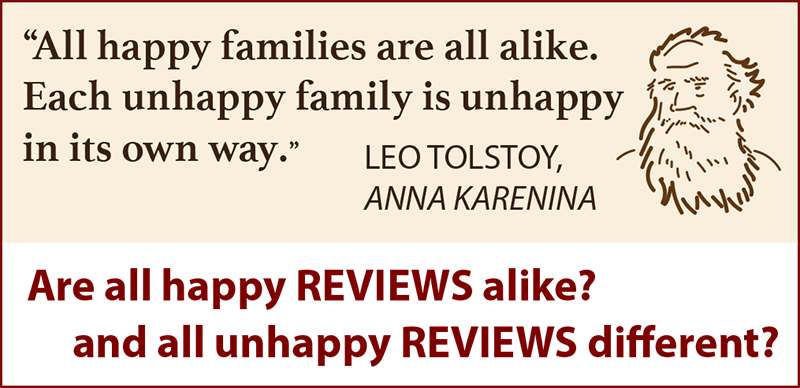
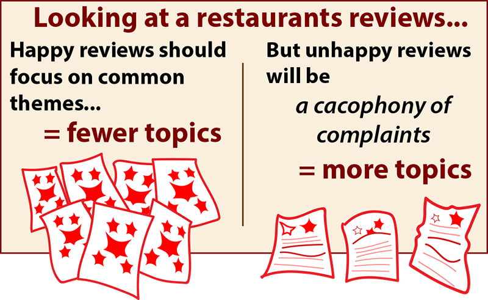
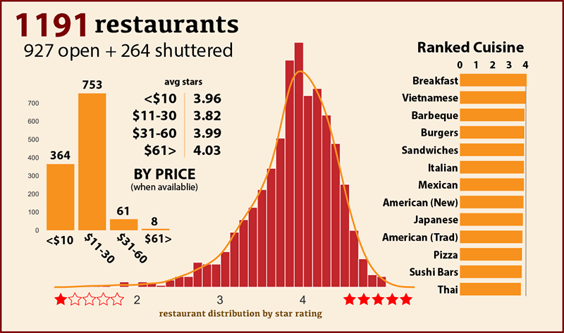
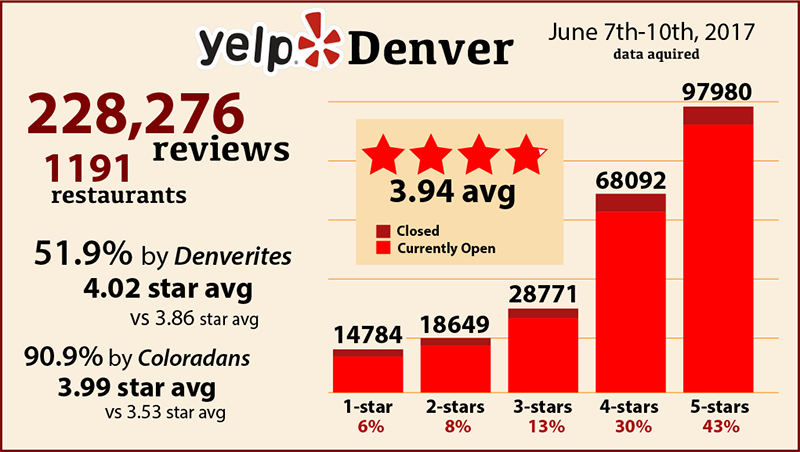
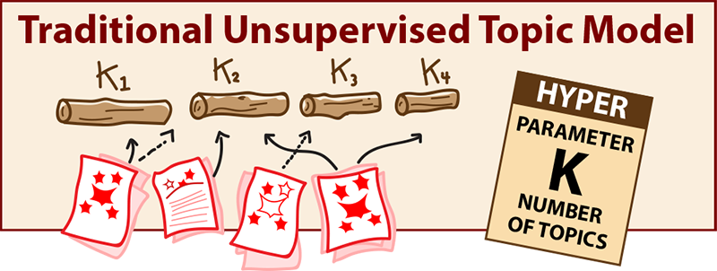
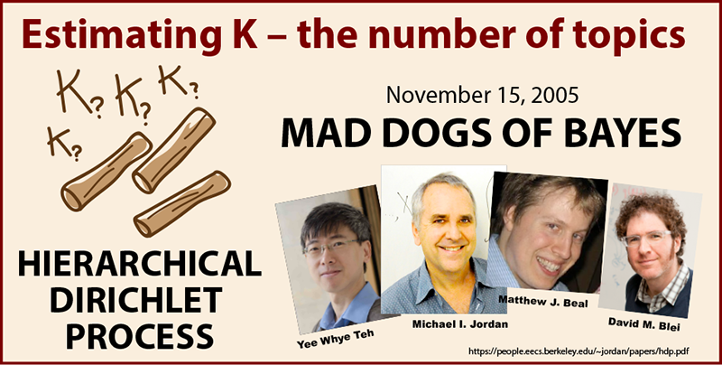
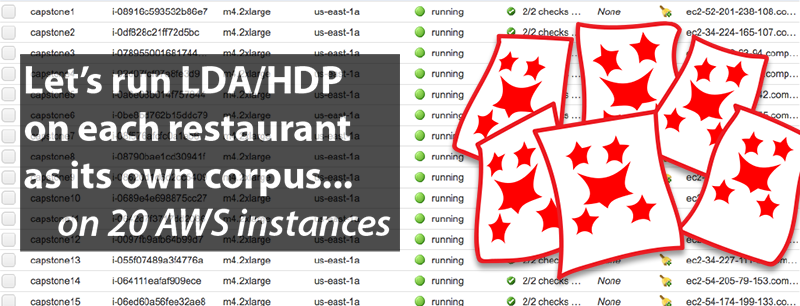

>"All happy families are alike; each unhappy family is unhappy in its own way" - Leo Tolstoy, _Anna Karenina_

# Objective

Can we predict a restaurant's Yelp rating from the number of topics in its reviews? Our premise is that when using unsupervised modeling, restaurants that are "happy" (well-reviewed) will have a more focused-distribution of topics among those reviews. And, conversely, the unhappy restaurants will be more diverse in their complaints.

# The Data
Our data comes from once place - Denver, Colorado. Yelp, by policy, returns up to 1000 businesses per query and that's it. This should be enough if we supplement it with some shuttered restaurants for balance. In early June, 2017, our query of <a href="https://www.yelp.com/search?cflt=restaurants&find_loc=Denver%2C+CO">restaurants in Denver</a> returned 992 active restaurants. After removing those with less than 10 reviews, our total number from Yelp stood at 921. With 71 restaurants having less than 10 reviews, this seems like a pretty good clue we are nearing the end the list for Denver regardless of Yelp's hard limit of 1000 search results.

For balance, I supplemented this list with 264 shuttered restaurants, arriving at a total of 1191 Denver restaurants. Survival bias is surely at play, and adding some shuttered restaurants to the mix might balance things out. From these 1191 restaurants, I grabbed all 228,276 their reviews. Not quite n=all for Denver restaurants on Yelp, but I think we are getting close. Surprisingly, at least for me, the overall average for all the reviews is 3.94 stars, well above the middling value of 3 one might naively suppose. Of note, Yelp rounds to the nearest half-star in their listing summary for a restaurant, but I've calculated the true star average for each restaurant based on all its reviews.

# EDA and problem ideation
As part of our initial EDA we clean and stem the reviews and run <a href="https://radimrehurek.com/gensim/models/ldamodel.html">Gensim's LDA model</a> on the entire corpus. LDA stands for Latent Dirichlet Allocation. This is a soft topic model that allows for each document in the corpus to belong to multiple topics.

At this point, I was not sure where the project was heading, and I was just looking over the results. One thing I noticed was how often family members are mentioned in reviews, and how highly ranked such terms are in the corpus of Denver Yelp reviews. A casual browsing will reveal many reviewers on Yelp speak for the entire party, mentioning what the other members of their party had or why they happened upon the restaurant.

This brought up the question, what is common among all the reviews, regardless of the food served? I wondered if I could create an enormous collection of food and family related stop words to get down to the most basic abstract quality of being a good review.

After a few attempts with LDA and TF-IDF to get at the heart of abstract goodness, I realized the task was impossible, at least for me. Topic models and similarity measures are always going to find a difference between sushi and steak restaurants at almost every pass. It dawned on me I could use they same unsupervised topic analysis on each restaurant separately as its own corpus. I would lose similarity measures across all the reviews in general, but we could compare intra-restaurant topic distributions. This seemed novel in itself - and worth a try. Of course, we have a corpus problem for smaller restaurants, dropping out those with less than 150 or so reviews

Finally, we arrive at our question: Do well-rated restaurants have more concentrated, cohesive reviews? Or more specifically, are there fewer topics in a happy restaurant's reviews.

# Measuring happiness by topic density

Traditional topic modeling has a parameter problem -- at least for our quest. The hyperparameter of the number of topics is set before any modeling is done. This holds for Latent Dirichlet Allocation or K-means (the K is chosen before hand), whether it is for 10, 20 or 100 topics. There are ways of estimating K after the fact. But this is not our question. We want to know if happy restaurants have few topics -- because happy people are writing about the same happy topics, and whether the grumpy people in poorly rated restaurants are grousing about individual, unique complaints.  
## Estimating K, the number of topics

 If there's ever a parameter you need estimated from the data itself, like K, the number of topics, you turn to the craziest people in data science, the Bayesians. It seems they can turn any model into a _NON_-parametric one if they just throw some more math and data on it. I was not mistaken. The "Mad Dogs of Bayes" in November of 2005 came up with the <a href="https://people.eecs.berkeley.edu/~jordan/papers/hdp.pdf">Hierarchical Dirichlet Processes</a>, which among other things, allows to estimate the number of topics in a corpus (or at least get a distribution we can truncate). I first considered using TF-IDF similarity measures within the reviews of for each restaurant. I had not given up on this approach when I stumbled upon the <a href="https://radimrehurek.com/gensim/models/hdpmodel.html">HDP model</a> in the Gensim documentation. (It should be noted I made up the "Mad Dogs of Bayes" nickname, to my knowledge they have no such moniker)

 With HDP, a variant of LDA, we are still using a bag-of-words model, treating each word as a draw in a MCMC approach. We are taking no account for the order. We wont' be parsing parts-of-speech, using n-grams or sentiment analysis. I use the NLTK package to lemmatize the reviews after cleaning the data and removing some basic stopwords.

# The processing
I ran the first batch of cleaning, lemmatizing and modeling overnight on the reviews. I had previously used a port-stemmer on the reviews in the LDA during EDA, but I wasn't happy with the ugly visualizations you get with stems. I wanted visually pleasing (and readable) lemmatizing for fancy interactive charts and such. It's also standard to remove infrequent words not mentioned more than n-times in a corpus (usually n is 5-10 times). For our question, I decided not to remove any words due to infrequency (other than stops). My thoughts were to see how well HDP could differentiate the good/bad reviews with no extra help. Removing low frequency words might be too much an aid to poor reviews and their individualized misery.

So much for my plan. I woke to find 8 restaurants had been processed, a few thousand reviews in total. This was going to take a month a single 2015 MacBook Air. AWS to the rescue. Time was already running short, I quickly benchmarked several variants of AWS machines, the t2.large's did as well on my test as bigger instances that cost twice as much. This was a rookie mistake. I didn't know it at the time, but the t2s are "Burstable Performance" instances whose computational power rapidly gets spent in continuous processing tasks of NLP. My 100 reviews per 300 seconds standard turned into 900 seconds! My overnight run on 8 t2 instances was a bust as well.

I went back to the old benchmarks and found that the m4.2xlarge preformed best for the buck, now excluding the t2s. Time was running really short on the project's deadline now. Far too short to even devise a queue system and brush up my Spark or Mr. Job. I did the only mathematical thing I could think of: I divided the tasks across the instances by taking the restaurant name mod 20, letting each instance numbered 0-19 take the restaurants whose name matched mod 20 its assigned number. Late at night, well past bedtime, the instances ran under my watchful eye. The pandas' dataframes and Gensim models were pickled restaurant by restaurant and sync'd via S3 command line tools on each instance. This took about 8 hours -- but could have been less if the reviews had been evenly divided among restaurants by name mod 20, but they weren't.

# References
