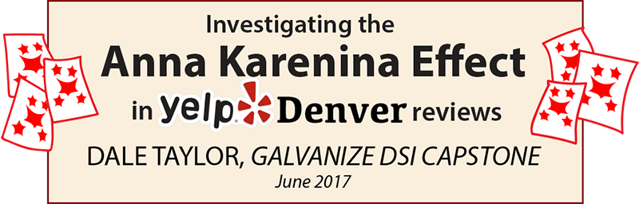

>"All happy families are alike; each unhappy family is unhappy in its own way" - Leo Tolstoy, _Anna Karenina_

# Objective

Can we predict a restaurant's Yelp rating from the number of topics in its reviews? Our premise is that when using unsupervised modeling, restaurants that are "happy" (well-reviewed) will have a more focused-distribution of topics among those reviews. And, conversely, the unhappy restaurants will be more diverse in their complaints.

# The Data
Our data comes from once place - Denver, Colorado. Yelp, by policy, returns up to 1000 businesses per query and that's it. This should be enough if we supplement it with some shuttered restaurants for balance. In early June, 2017, our query of <a href="https://www.yelp.com/search?cflt=restaurants&find_loc=Denver%2C+CO">restaurants in Denver</a> returned 992 active restaurants. After removing those with less than 10 reviews, our total number from Yelp stood at 921. With 71 restaurants having less than 10 reviews, this seems like a pretty good clue we are nearing the end the list for Denver regardless of Yelp's hard limit of 1000 search results.

For balance, I supplemented this list with 264 shuttered restaurants, arriving at a total of 1191 Denver restaurants. Survival bias is surely at play, and adding some shuttered restaurants to the mix might balance things out. From these 1191 restaurants, I grabbed all 228,276 their reviews. Not quite n=all for Denver restaurants on Yelp, but I think we are getting close. Surprisingly, at least for me, the overall average for all the reviews is 3.94 stars, well above the middling value of 3 one might naively suppose. Of note, Yelp rounds to the nearest half-star in their listing summary for a restaurant, but I've calculated the true star average for each restaurant based on all its reviews.

# The process
We're going to use unsupervised latent topic analysis. We are not giving hints or labels to our topic modeling algorithms.

# The measurement

# The recommendations

# References
